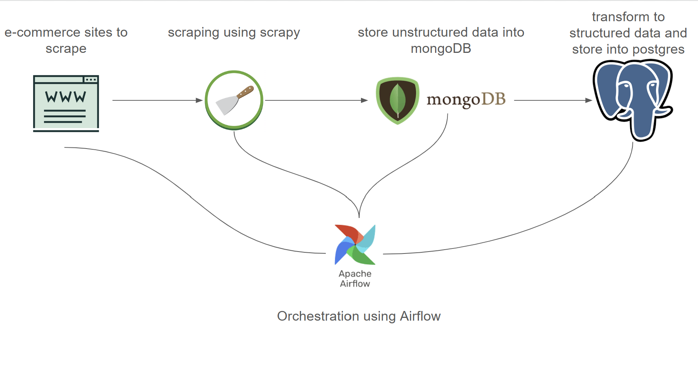

# e-commerce-pipeline

An ETL pipeline designed as a study project for extracting, transforming, and loading e-commerce data.

This project utilizes **Scrapy** for web scraping e-commerce data, **Apache Airflow** for orchestrating ETL workflows, and **PostgreSQL** for storing and managing the scraped data. The pipeline demonstrates the complete data lifecycle, from extraction to loading, with potential applications in data analysis and reporting.

## Project Goals
- Gain experience with new tools and technologies
- Develop data engineering skills
- Design a comprehensive data pipeline

The project is divided into the following steps:
1. Develop web scrapers to acquire data from e-commerce sources.
2. Set up a relational database or data warehouse to store the extracted data.
3. Use Apache Airflow to orchestrate data extraction and loading processes.
4. Organize a pipeline to clean, transform, and validate the data.
5. (Optional) Build a machine learning or statistical model.
6. Perform analysis on the acquired data.
7. Create a dashboard that updates automatically each time the pipeline runs.
8. Fully orchestrate all pipeline steps with Airflow.

## Key Learnings
- Building custom web scrapers using Scrapy
- Storing, managing, and modeling data in MongoDB
- Developing ETL pipelines with Apache Airflow

## Data Pipeline
The data pipeline involves scraping e-commerce sites using Scrapy, storing raw and semi-structured data as JSON documents in MongoDB, processing and cleaning the data, and then storing it in a PostgreSQL database. Airflow is used to orchestrate the entire pipeline.
<br>
<br>


## Running Scrapy crawlers
```bash
cd crawlers/scrapers
scrapy crawl spider_crawler -O scraped_results.json
```

## Running Airflow
Running for the first time airflow
```bash
cd airflow
docker compose up airflow-init
```

### Cleaning up
To stop and delete containers, delete volumes with database data and download images, run:
```bash
docker compose down --volumes --rmi all
```